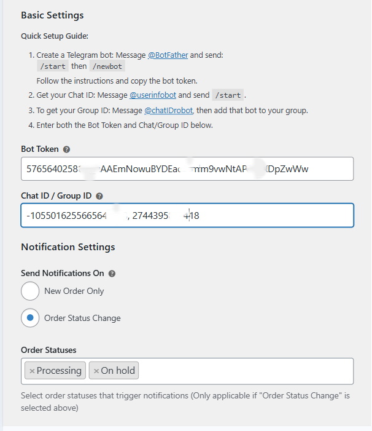
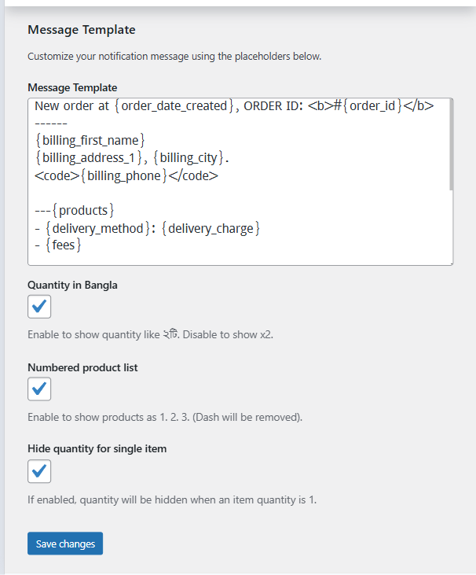
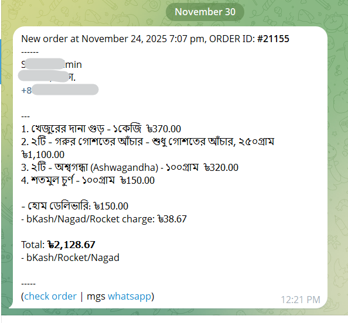

## Order Notification for Telegram

Send WooCommerce order notifications to Telegram instantly.

---

## Description

**Order Notification for Telegram** is a lightweight WooCommerce plugin that sends order notifications directly to your Telegram account or group.

You can fully customize the message template using placeholders, include delivery charges and extra gateway fees, and control how product quantities are displayed.

## Features

- Instant WooCommerce order notifications in Telegram
- Supports **New Order** and **Order Status Change** notifications
- Fully customizable message template with a lot of placeholders
- (new) Product list includes variations only once (no duplicate variation text)
- (new) Optional numbered product list (1. 2. 3.) instead of dash list
- (new) Quantity display options:
  - Default English format: `x2` Optional Bangla format: `২টি`
  - Optional: hide quantity when item count is 1
  - Quantity is shown before product name when enabled
- (new) Delivery charge & extra gateway fees placeholders supported
- (new) Supports **multiple Chat/Group IDs** (comma-separated)
- Telegram HTML formatting supported (safe tags only)
- Clean baseline code (no legacy nktgnfw files)

## Quick Setup Guide

1. Install and activate the plugin.
2. Create a Telegram bot:
   - Message **@BotFather**
   - Send `/start` then `/newbot`
   - Follow the instructions and copy your bot token
3. Get your Chat ID:
   - Message **@userinfobot**
   - Send `/start`
4. To get a Group ID:
   - Message **@chatIDrobot**
   - Add that bot to your group
5. Go to **WooCommerce → Settings → Telegram Notifications**
6. Enter your **Bot Token** and **Chat/Group ID**
   - You can enter multiple IDs separated by comma  
     Example: `-1001234567890, 12345678`

## Screenshots

## Support

For bugs, feature requests, or help:  
- Open an issue on GitHub  
- Or contact the main author

---

## Credits

Originally based on ChoPlugins' version:  
https://choplugins.com/en/product/order-notification-for-telegram

Maintained & improved by almahmud.
